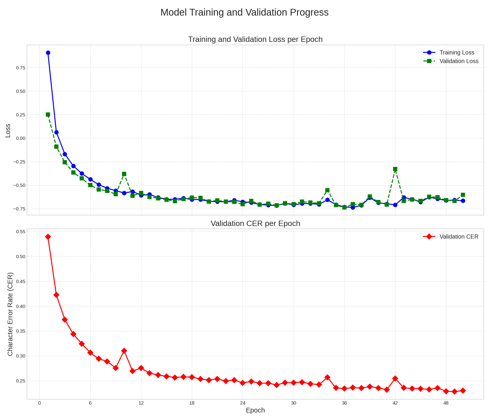
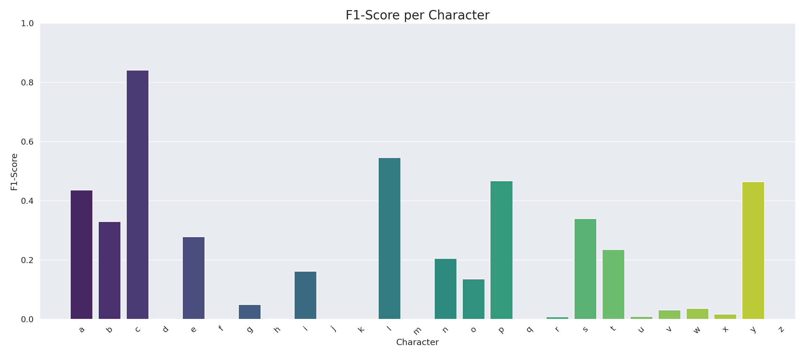
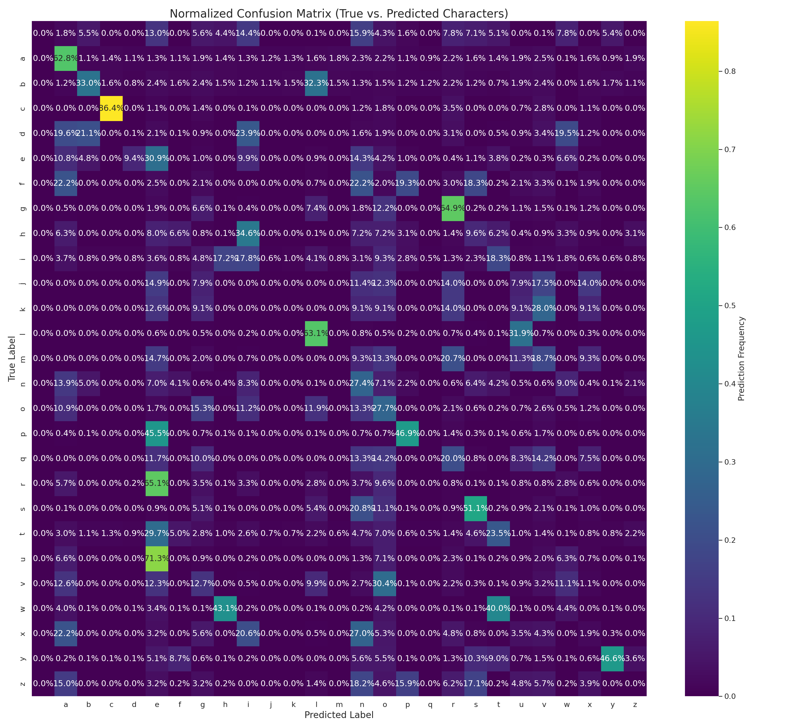

# Real-Time Silent Speech Recognition via Lip-Reading

<p >
A complete silent speech recognition system that translates live lip movements from a webcam into text in real-time. This project uses a custom-defined deep learning architecture built from scratch in PyTorch, featuring a CNN for spatial feature extraction and an LSTM for temporal modeling, trained with CTC loss. The model achieves approximately <strong>77% character-level accuracy</strong> on the constrained GRID dataset.
</p>
<p align="center">


</p>

---

## 📜 Table of Contents
*   [About The Project](#-about-the-project)
*   [Project Structure](#-project-structure)
*   [End-to-End Workflow](#-end-to-end-workflow)
*   [Model Architecture in Detail](#-model-architecture-in-detail)
*   [Performance & Evaluation](#-performance--evaluation)
*   [Future Scope](#-future-scope)


---

## 📋 About The Project
This project provides a comprehensive, end-to-end pipeline for building, training, and deploying a real-time lip-reading model. Unlike approaches that rely on pre-built models, every layer of this system's neural network was defined from scratch, offering deep insight into the architectural relationships between its components.
The core of the system is a custom CNN+LSTM architecture trained with a Connectionist Temporal Classification (CTC) loss function. This powerful combination allows the model to learn the complex spatio-temporal features of lip movements and transcribe them into text without requiring explicit frame-by-character alignment. The model was trained on the benchmark GRID Corpus dataset, a collection of structured command sentences.
The final application can run directly on a live webcam feed, demonstrating the potential for silent speech recognition in accessibility and human-computer interaction.

---

## 📂 Project Structure

This is the final, clean structure of the project, with a description for each key file and folder.

```text
lip_reading_project/
├── data/                         # Stores the raw, extracted GRID dataset videos and alignments.
├── processed_grid_data/          # Contains preprocessed .npy files (video frames) for fast training.
├── saved_models/                 # Contains the trained model weights.
│   └── lipread_cnn_lstm_ctc_grid.pth # The best performing model checkpoint.
├── evaluation_results/           # Contains all generated performance reports and plots.
│   ├── confusion_matrix_final.png      
│   ├── f1_scores_final.png             
│   └── learning_curves_final.png             
├── dataset.py                    # PyTorch Dataset and DataLoader definitions.
├── model.py                      # The custom CNN+LSTM model architecture defined from scratch.
├── train.py                      # Script for training the model.
├── realtime_lipread.py           # Main application script for live webcam inference.
├── evaluate_and_plot.py          # Script to generate final accuracy metrics and plots.
├── plot_learning_curves.py       # Script to visualize the training process from the log file.
├── preprocess_grid.py            # Utility to convert raw GRID videos to processed numpy arrays.
├── grid_manifest.csv             # Maps preprocessed video files to their text transcripts.
├── training_log_grid.txt         # Detailed log of the training process, losses, and metrics.
│
├── README.md                     # Add comprehensive project README with full workflow and architecture
└── visualize_model.py            # To generate and save a detailed, layer-by-layer summary of the custom PyTorch model's architecture.
```
---

## ⚙️ End-to-End Workflow From Scratch
This guide provides every command needed to replicate this project, from setting up the environment to running the live demo.

---

### Step 1: Setup the Environment
Clone the repository:

```bash
git clone <your-repo-link>
cd lip_reading_project
```

Create and activate a virtual environment:
```bash
python3 -m venv venv
source venv/bin/activate
```

Install all required packages:
```bash
pip install -r requirements.txt
```
Download Dlib Predictor Model:
```bash
wget http://dlib.net/files/shape_predictor_68_face_landmarks.dat.bz2 
bunzip2 shape_predictor_68_face_landmarks.dat.bz2
```
---

### Step 2: Download and Prepare Raw Data

Download the Dataset: The model was trained on the GRID Corpus dataset. Download it from Kaggle:

Link: https://www.kaggle.com/datasets/jedidiahangekouakou/grid-corpus-dataset-for-training-lipnet

Extract and Organize: Extract the downloaded archive. Rename the main extracted folder to data and place it in the project's root directory.

Strategically chose the GRID Corpus to focus on the core challenge of building and validating a custom spatio-temporal model architecture from scratch. Instead of tackling unpredictable "in-the-wild" video, GRID provides a controlled environment with a highly constrained vocabulary and grammar, defined by these key numbers:

* Total Videos: ~33,000 (from 33 speakers)
* Vocabulary Size: A tiny vocabulary of only 51 unique words.
* Fixed Grammar: A rigid 6-word sentence structure (command color prep letter digit adverb).
* Controlled Environment: Front-facing speakers with consistent lighting and no head movement.

### Step 3: Preprocess Data for Training
Run the preprocessing script to detect faces, extract mouth ROIs, and save them as numpy arrays. This is a one-time, lengthy step.

```bash
python preprocess_grid.py
```
This will create the processed_grid_data/ folder and the grid_manifest.csv file.

### Step 4: Train the Model
Now you can run the training script. This will train the CNN+LSTM model from scratch. The best model based on validation CER will be saved to saved_models/.

```bash
python train.py
```

### Step 5: Evaluate the Trained Model
To generate the performance reports and plots for the model you just trained, run the evaluation script:

```bash
python evaluate_and_plot.py
```
The results (confusion matrix, F1-score chart) will be saved in the project's root directory.

### Step 6: Run the Live Application
To start the application using your live webcam feed:
```bash
python realtime_lipread.py

Press 'q' while the window is active to quit.
```

## 🧠 Model Architecture 
The system's intelligence lies in its custom-defined, two-stage architecture that processes both spatial and temporal information.
1. CNN Backbone (Spatial Feature Extractor):
Purpose: To analyze each individual frame of the video and extract relevant visual features from the mouth region.
Structure: A stack of four Conv2d layers, each followed by BatchNorm2d, a ReLU activation, and MaxPool2d. This progressively downsamples the image while building a rich feature representation of shapes, edges, and textures corresponding to lip formations (visemes).
Output: A fixed-size feature vector for each frame.
2. Bidirectional LSTM (Temporal Modeler):
Purpose: To understand the sequence of lip movements over time. Lip-reading is not about static images, but about the dynamics of motion.
Structure: A 2-layer bidirectional LSTM takes the sequence of feature vectors from the CNN. By processing the sequence both forwards and backwards, it captures context from past and future frames to make a more informed prediction for each moment in time.
Output: A sequence of context-aware feature vectors.
3. CTC Loss & Decoder:
Challenge: The exact timing of when a character is spoken is unknown.
Solution: A final linear classifier outputs a probability distribution over all characters (plus a special 'blank' token) for each time step. The CTC Loss function then intelligently calculates the loss by summing the probabilities of all possible alignments between the model's output and the true text, elegantly solving the alignment problem. During inference, a Greedy CTC Decoder translates the frame-by-frame predictions back into human-readable text.

The overall data flow through the model's major stages is as follows:


  
```
==========================================================================================
        Model Architecture: Data Flow from Pixels to Text
==========================================================================================

              Input Video Sequence (Batch, Time, Channels, Height, Width)
                    [ B, 75, 1, 96, 96 ]
                              │
                              ▼
        ┌──────────────────────────────────────────────────────────────┐
        │   Reshape 5D Video Tensor into a 4D Batch of Frames          │
        │   CHALLENGE: CNNs process images (4D), not videos (5D).      │
        │   SOLUTION:  Temporarily combine Batch and Time dimensions.  │
        └──────────────────────────────────────────────────────────────┘
                              │ Shape: (B, 75, 1, 96, 96) -> (B * 75, 1, 96, 96)
                              ▼
┌========================================================================================┐
| STAGE 1: SPATIAL FEATURE EXTRACTION (CNN BACKBONE)                                     |
| GOAL: Analyze each of the (B * 75) frames independently to extract visual features.    |
|----------------------------------------------------------------------------------------|
|                                                                                        |
|   Input Frame Batch (B * 75, 1, 96, 96)                                                |
|             │                                                                          |
|             ▼                                                                          |
|   ┌──────────────────────────────────┐                                                 |
|   │ CONV BLOCK 1 (32 filters)        │  Learns simple edges & curves.                  |
|   │ Conv2d -> BN -> ReLU -> MaxPool  │                                                 |
|   └──────────────────────────────────┘                                                 |
|             │ Shape -> (B * 75, 32, 48, 48)                                            |
|             ▼                                                                          |
|   ┌──────────────────────────────────┐                                                 |
|   │ CONV BLOCK 2 (64 filters)        │  Combines edges into basic shapes.              |
|   │ Conv2d -> BN -> ReLU -> MaxPool  │                                                 |
|   └──────────────────────────────────┘                                                 |
|             │ Shape -> (B * 75, 64, 24, 24)                                            |
|             ▼                                                                          |
|   ┌──────────────────────────────────┐                                                 |
|   │ CONV BLOCK 3 (96 filters)        │  Learns more complex mouth parts.               |
|   │ Conv2d -> BN -> ReLU -> MaxPool  │                                                 |
|   └──────────────────────────────────┘                                                 |
|             │ Shape -> (B * 75, 96, 12, 12)                                            |
|             ▼                                                                          |
|   ┌──────────────────────────────────┐                                                 |
|   │ CONV BLOCK 4 (128 filters)       │  Recognizes abstract viseme-like features.      |
|   │ Conv2d -> BN -> ReLU -> MaxPool  │                                                 |
|   └──────────────────────────────────┘                                                 |
|             │ Shape -> (B * 75, 128, 6, 6)                                             |
|             ▼                                                                          |
|   ┌──────────────────────────────────┐                                                 |
|   │ FLATTEN & PROJECT                │  Consolidates all spatial information.          |
|   │ Flatten -> Linear(4608 -> 512)   │                                                 |
|   └──────────────────────────────────┘                                                 |
|             │                                                                          |
|             ▼                                                                          |
|   Output: Batch of Frame Feature Vectors                                               |
|           Shape: (B * 75, 512)                                                         |
|                                                                                        |
└========================================================================================┘
                              │
                              ▼
        ┌──────────────────────────────────────────────────────────────┐
        │   Re-assemble Frame Features back into Video Sequences       │
        │   CHALLENGE: LSTM needs sequential data, not a flat batch.   │
        │   SOLUTION:  Separate the Batch and Time dimensions again.   │
        └──────────────────────────────────────────────────────────────┘
                              │ Shape: (B * 75, 512) -> (B, 75, 512)
                              ▼
┌========================================================================================┐
| STAGE 2: TEMPORAL MODELING (BIDIRECTIONAL LSTM)                                        |
| GOAL: Analyze the sequence of 75 feature vectors to understand motion and context.     |
|----------------------------------------------------------------------------------------|
|                                                                                        |
|   Input: Sequence of Feature Vectors                                                   |
|          Shape: (B, 75, 512)                                                           |
|             │                                                                          |
|             ▼                                                                          |
|   ┌──────────────────────────────────┐                                                 |
|   │ BIDIRECTIONAL LSTM (2 Layers)    │  Analyzes sequence forwards and backwards.      |
|   │ Hidden Size: 256 per direction   │  CHALLENGE: Visemes (e.g., 'pa' vs 'ma')        |
|   └──────────────────────────────────┘  can look similar but have different motions.   |
|                                         SOLUTION: Bidirectionality captures this       |
|                                         crucial past and future context.               |
|             │                                                                          |
|             ▼                                                                          |
|   Output: Sequence of Context-Aware Features                                           |
|           Shape: (B, 75, 512)  <- (256 forward + 256 backward)                         |
|                                                                                        |
└========================================================================================┘
                              │
                              ▼
┌========================================================================================┐
| STAGE 3: CLASSIFICATION & CTC PREPARATION                                              |
| GOAL: Translate the context-aware features into character probabilities for each frame.|
|----------------------------------------------------------------------------------------|
|                                                                                        |
|   Input: Context-Aware Feature Sequence                                                |
|          Shape: (B, 75, 512)                                                           |
|             │                                                                          |
|             ▼                                                                          |
|   ┌──────────────────────────────────┐                                                 |
|   │ LINEAR CLASSIFIER                │  Projects features to character scores (logits).|
|   │ Linear(512 -> 37)                │  (26 letters + 10 digits + 1 blank token)       |
|   └──────────────────────────────────┘                                                 |
|             │ Shape -> (B, 75, 37)                                                     |
|             ▼                                                                          |
|   ┌──────────────────────────────────┐                                                 |
|   │ LOG SOFTMAX & PERMUTE            │  Converts logits to log probabilities and       |
|   │                                  │  rearranges tensor for CTC compatibility.       |
|   └──────────────────────────────────┘                                                 |
|             │ Shape -> (75, B, 37)                                                     |
|             ▼                                                                          |
|   Output: Log Probability Matrix                                                       |
|           Shape: (Time, Batch, Classes)                                                |
|                                                                                        |
└========================================================================================┘
                              │
                              ▼
        ┌──────────────────────────────────────────────────────────────┐
        │   This final tensor is the input to:                         │
        │   1. CTC Loss Function (during Training)                     │
        │   2. CTC Decoder (during Inference)                          │
        └──────────────────────────────────────────────────────────────┘
```
[see more ..](./model_architecture.txt)

## 📊 Performance & Evaluation

Local Machine Specifications

---

* OS:         Ubuntu 24.04.2 LTS x86_64
* Host:       ASUS TUF Gaming A15 FA507RM
* Kernel:     6.11.0-21-generic
* CPU:        AMD Ryzen 7 6800H (16 cores) @ 4.79GHz
* GPU 1:      AMD Radeon 680M
* GPU 2:      NVIDIA GeForce RTX 3060 Mobile / Max-Q
* Memory:     16GB

The model was trained for 50 epochs on the GRID dataset. The entire training process took approximately 9 hours on an NVIDIA GPU, with the best-performing checkpoint saved based on the validation Character Error Rate (CER). The following metrics reflect the performance of this best checkpoint on the unseen test set.

```
Overall Character Error Rate (CER): 22.90%
Character-Level Accuracy: 77.10%
```
## Learning Curves
The training progress shows a clear decrease in both training and validation loss, while the Character Error Rate (CER) on the validation set steadily improved, indicating successful learning.



## Final Evaluation Metrics
The following reports were generated by evaluate_and_plot.py.
F1-Score per Character
The F1-score bar chart highlights the model's strong performance on most characters, while also identifying characters that are more visually ambiguous and thus harder to classify.



## Confusion Matrix
The confusion matrix provides a detailed view of classification performance. The strong, bright diagonal indicates a high rate of correct predictions for most characters. Off-diagonal bright spots reveal common confusions between visually similar characters (visemes), which is a classic challenge in lip-reading.



## 📈 Future Scope
**Advanced Decoding:** Implement a CTC Beam Search Decoder instead of the current greedy decoder. This would likely improve accuracy, especially in resolving ambiguous sequences and predicting spaces more reliably.

**Data-Centric Improvement:** Train the model on larger, more diverse "in-the-wild" datasets like LRW-1000 or LRS2 to improve its generalization to real-world, unconstrained speech.

**Architectural Enhancements:** Replace the 2D CNN with a 3D or (2+1)D CNN to allow the model to learn spatio-temporal features directly in the convolutional layers, which has been shown to improve performance.

**Deployment Optimization:** Convert the trained PyTorch model to an optimized format like ONNX for deployment on edge devices or in web applications with faster inference speeds.