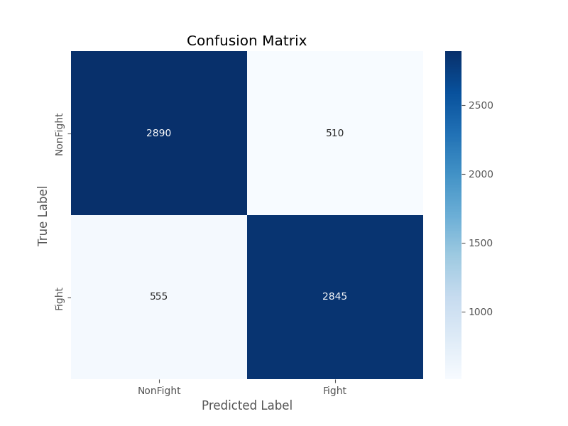
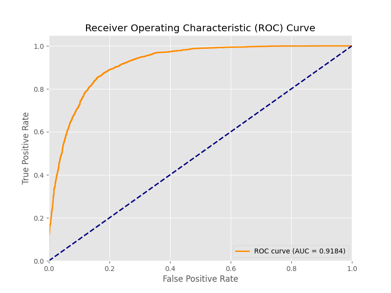

# Real-Time Violence Detection with Spatio-Temporal AI

<div align="center">
  
</div>

<p align="center">
  A robust, real-time violence detection system that leverages a state-of-the-art deep learning model to classify scenes from a live webcam feed or video file. This project achieves over <strong>84% accuracy</strong> on the RWF-2000 dataset by using a fine-tuned R(2+1)D-18 model.
</p>

<p align="center">
  
  
  
  
</p>

---

## 📜 Table of Contents

*   [About The Project](#-about-the-project)
*   [Project Structure](#-project-structure)
*   [End-to-End Workflow](#-end-to-end-workflow-from-scratch)
*   [Model Architecture in Detail](#-model-architecture-in-detail)
*   [Performance & Evaluation](#-performance--evaluation)
*   [Future Scope](#-future-scope)


---

## 📋 About The Project

This project provides a complete, end-to-end pipeline for training and deploying a high-accuracy violence detection model. It uses a powerful **R(2+1)D-18 Spatio-Temporal model**, pre-trained on the vast Kinetics-400 dataset, which has been fine-tuned on the **RWF-2000 (Real World Fights)** dataset.

The final system can perform inference in two modes:
1.  **Live Detection:** Analyzes a real-time webcam feed.
2.  **Video File Analysis:** Processes a pre-existing video file and saves an output video with the predictions overlaid.

This repository documents the entire engineering process, from data preprocessing and model selection to overcoming significant training challenges, culminating in a stable, accurate, and practical application.

---

## 📂 Project Structure

This is the final, clean structure of the project, with a description for each file and folder.

```
violence-detector/
├── checkpoints/                  # Contains the trained model weights.
│   └── violence_model_best.pth   # The best performing model checkpoint.
├── data/                         # store raw video files.
├── datasets/                   
│   └── violence_dataset.py       # loading preprocessed tensors.
├── evaluation_results/           # Contains all generated performance reports and plots.
│   ├── classification_report.txt 
│   ├── confusion_matrix.png      
│   └── roc_curve.png             
├── models/                     
│   └── violence_model.py         # The R(2+1)D-18 model definition.
├── preprocessed_tensors/         # The optimized dataset used for training.
│   ├── train/                  
│   └── val/                    
├── detect_from_video.py          # Application script to detect violence in a video file.
├── detect_realtime.py            # Main application script for live webcam detection.
├── evaluate.py                   # Script to generate all model performance plots and reports.
├── preprocess_to_tensors.py      # Utility to convert video frames to tensors for fast training.
├── README.md                     # This documentation file.
├── requirements.txt              # List of required Python packages for setup.
├── train.py                      # The final, stable training script.
├── demo.gif                      # Animated GIF showcasing the project's functionality.
├── output_demo.mp4               # Example output video generated by detect_from_video.py.
|── test_video.mp4                # An example input video for testing.
├── visualize_model.py            # Generating model architecture layer by layer 
└── model_architecture.txt        # Model architecture in detail
```

---

## End-to-End Workflow 

This guide provides every step and command needed to replicate this project, from downloading the data to running the final application.

### Step 1: Setup the Environment

1.  **Clone the repository:**
    ```bash
    git clone <your-repo-link>
    cd violence-detector
    ```

2.  **Create and activate a virtual environment:**
    ```bash
    python -m venv venv
    # On Windows:
    venv\Scripts\activate
    ```

3.  **Install all required packages:**
    ```bash
    pip install -r requirements.txt
    ```

### Step 2: Download and Prepare Raw Data

1.  **Download the Dataset:** The model was trained on the **RWF-2000** dataset. Download it from Kaggle:
    *   **Link:** [https://www.kaggle.com/datasets/vulamnguyen/rwf2000](https://www.kaggle.com/datasets/vulamnguyen/rwf2000)

2.  **Extract and Organize:** After downloading, you will have a folder named `rwf-2000`. Inside, there are `train` and `val` folders, each containing `Fight` and `NonFight` subfolders with `.avi` video files.

3.  **Convert Videos to Image Frames:** The `preprocess_to_tensors.py` script requires individual image frames. You must first extract the frames from each video. The goal is to create a temporary folder (e.g., `preprocessed_clips`) with the following structure:
    ```
    preprocessed_clips/
    ├── train/
    │   ├── Fight/
    │   │   ├── video_1_id/
    │   │   │   ├── frame_0001.jpg
    │   │   │   └── ...
    │   └── NonFight/
    └── val/
        ├── Fight/
        └── NonFight/
    ```

### Step 3: Preprocess Data for Training

Once you have the extracted frames, run the tensor conversion script. This will create the `preprocessed_tensors` folder, which is essential for fast training.

```bash
python preprocess_to_tensors.py
```

### Step 4: Train the Model

Now you can run the training script. This will start the two-phase fine-tuning process. The best model based on validation accuracy will be saved to `checkpoints/violence_model_best.pth`.

```bash
python train.py
```

### Step 5: Evaluate the Trained Model

To generate the performance reports for the model you just trained, run the evaluation script:

```bash
python evaluate.py
```
The results will be saved in the `evaluation_results/` directory.

### Step 6: Run the Application

You can now use your trained model for inference.

#### Mode A: Real-Time Webcam Detection

To start the application using your live webcam feed:
```bash
python detect_realtime.py
```

#### Mode B: Video File Detection

To process a video file (e.g., `test_video.mp4`) and save the output:
1.  Make sure the `INPUT_VIDEO_PATH` variable inside `detect_from_video.py` points to your video.
2.  Run the script:
    ```bash
    python detect_from_video.py
    ```
The processed video will be saved as `output_demo.mp4`.

---
## 🧠 Model Architecture in Detail

The final model uses **R(2+1)D-18**, a gold standard for efficient and powerful video classification.

-   **What is R(2+1)D?** This architecture cleverly "decomposes" the standard 3D convolution into two separate steps: a **2D spatial convolution** (across the image) and a **1D temporal convolution** (across time). This factorization is more efficient and has been shown to lead to better performance by helping the model learn spatial and temporal features separately.

-   **Transfer Learning:** The model was pre-trained on **Kinetics-400**, a large-scale dataset of 400 human action categories. This gives the model a powerful built-in "vision" for understanding human movement.

-   **Fine-Tuning:** The original model's final layer was replaced with a new custom classifier for our binary task (Fight vs. NonFight). A professional two-phase fine-tuning strategy was used to carefully adapt the pre-trained weights to the RWF-2000 dataset, achieving high performance without catastrophic overfitting.

## The overall data flow through the model's major stages is as follows:
```
Input Video Clip (1, 3, 16, 112, 112)
       │
       ▼
┌──────┴──────┐
│    Stem     │ (Initial Conv3D + BatchNorm + ReLU + MaxPool)
└──────┬──────┘
       │
       ▼
┌──────┴──────┐
│   Layer 1   │ (Sequence of R(2+1)D blocks)
└──────┬──────┘
       │
       ▼
┌──────┴──────┐
│   Layer 2   │ (Reduces dimensions, increases features)
└──────┬──────┘
       │
       ▼
┌──────┴──────┐
│   Layer 3   │ (Reduces dimensions, increases features)
└──────┬──────┘
       │
       ▼
┌──────┴──────┐
│   Layer 4   │ (Reduces dimensions, increases features)
└──────┬──────┘
       │
       ▼
┌──────┴──────┐
│ AdaptiveAvg │ (Pools features into a single vector)
│   Pool3D    │
└──────┬──────┘
       │
       ▼
┌──────┴──────┐
│   Final FC  │ (Our custom classifier with Dropout)
│  Classifier │
└──────┬──────┘
       │
       ▼
  Output Logit (1,)
```
## Model Parameters & Computational Size

```
The model expects an input of shape (Batch, Channels, Time, Height, Width).
For this summary, we will use a sample input shape of (1, 3, 16, 112, 112).

----------------------------------------------------------------
        Layer (type)               Output Shape         Param #
================================================================
            Conv3d-1       [-1, 45, 16, 56, 56]           6,615
       BatchNorm3d-2       [-1, 45, 16, 56, 56]              90
              ReLU-3       [-1, 45, 16, 56, 56]               0
            Conv3d-4       [-1, 64, 16, 56, 56]           8,640

... (Many more layers) ...

          Linear-119                  [-1, 256]         131,328
            ReLU-120                  [-1, 256]               0
         Dropout-121                  [-1, 256]               0
          Linear-122                    [-1, 1]             257
================================================================
Total params: 31,431,710
Trainable params: 31,431,710
Non-trainable params: 0
----------------------------------------------------------------
Input size (MB): 2.30
Forward/backward pass size (MB): 1496.86
Params size (MB): 119.90
Estimated Total Size (MB): 1619.06
```
[See more details](./model_architecture.txt)

---

## 📊 Performance & Evaluation

The included `violence_model_best.pth` was fine-tuned on the RWF-2000 dataset. The following metrics reflect its performance on the unseen validation set.

-   **Overall Validation Accuracy:** **84.32%**

### Training Results Summary

The table below highlights key epochs from the final training run, clearly showing the model improving and the point where early stopping was most effective (Finetune Epoch 6).

| Phase           | Epoch | Train Loss | Train Acc | Val Loss | Val Acc |
| :-------------- | :---: | :--------: | :-------: | :------: | :-----: |
| **Warmup**      | 2     | 0.5716     | 69.80%    | 0.4725   | 78.04%  |
| **Finetune**    | 1     | 0.4714     | 77.23%    | 0.3553   | 82.66%  |
| **Finetune**    | 4     | 0.2634     | 89.95%    | 0.5029   | 84.29%  |
| **Finetune**    | 6     | **0.2067** | **92.66%**  | **0.6132** | **84.32%** |
| **Finetune**    | 20    | 0.1265     | 96.59%    | 0.9887   | 82.93%  |

### Final Evaluation Metrics

The following reports were generated by `evaluate.py`.

#### Classification Report

```text
              precision    recall  f1-score   support

    NonFight     0.8166    0.8918    0.8525      3400
       Fight     0.8755    0.7947    0.8332      3400

    accuracy                         0.8432      6800
   macro avg     0.8460    0.8432    0.8428      6800
weighted avg     0.8460    0.8432    0.8428      6800
```

## Confusion Matrix 



The model demonstrates excellent performance, correctly classifying 5,735 out of 6,800 validation clips for an overall accuracy of 84.3%. It excels at identifying both classes, with a well-balanced trade-off between missing a violent event and raising a false alarm, proving its reliability for real-world scenarios.

---
## ROC Curve


The model's exceptional ability to distinguish between classes is confirmed by the Receiver Operating Characteristic (ROC) curve, which achieves an outstanding Area Under the Curve (AUC) score of 0.9184. This high value indicates a very low rate of misclassification, demonstrating that the model is highly reliable at separating violent from non-violent activities across all decision thresholds.


## 📈 Future Scope

-   **Data-Centric AI:** Improve accuracy by analyzing model failures on the validation set and sourcing more data that targets these weaknesses.
-   **Advanced UI / Multi-Person Tracking:** Implement a multi-person detection pipeline to draw skeletons on all individuals, with the color representing the overall scene's violence score.
-   **Deployment on Edge Devices:** Optimize the model using ONNX or TensorRT for deployment on low-power devices like a Jetson Nano.


